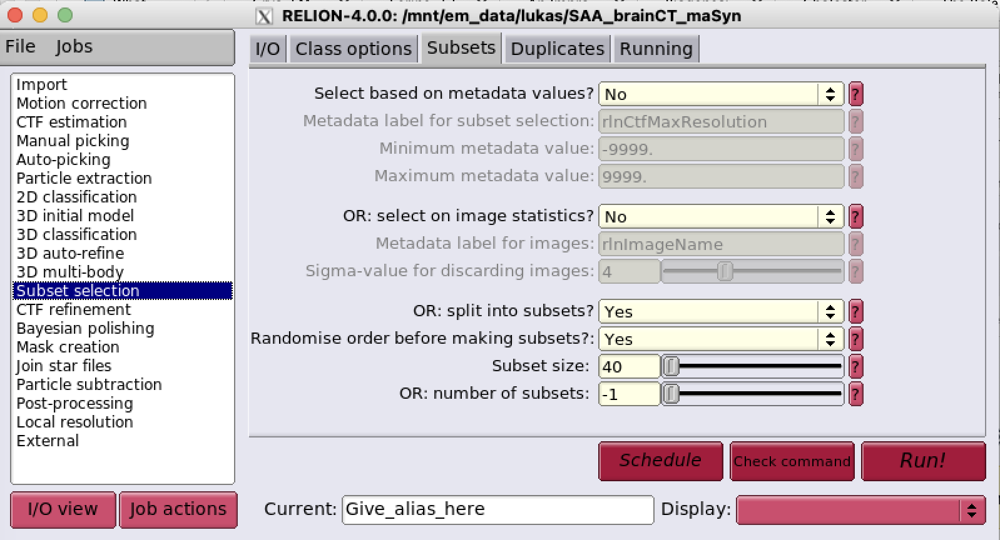

# dog-filament-picking

## Installation  
1. Install napari following these instructions: https://napari.org/stable/tutorials/fundamentals/installation.html#napari-installation
2. Activate the napari environment ```conda activate napari-env```
3. Install mrcfile with ```pip install mrcfile```

## Make a subset selection 




## Copy the selection to your local machine

- Open ```copy_mrc_files.py``` and enter filepaths:
    ```python
    import os

    ### PARAMS ###
    root = '/Users/lukasvandenheuvel/Documents/PhD/Data-temp/LH007_1B-seeding/SAA_brainCT_maSyn/randommrcs'
    input_starfile = '/Users/lukasvandenheuvel/Documents/PhD/Data-temp/LH007_1B-seeding/SAA_brainCT_maSyn/randommrcs/micrographs_split1.star'
    root_remote = '/mnt/em_data/lukas/SAA_brainCT_maSyn'
    job_nr =13

    with open(os.path.join(root,input_starfile),'r') as f:
        lines = f.readlines()
    mrcfiles = [f.split()[0] for f in lines if '.mrc' in f]

    for file in mrcfiles:
        os.system(f'scp cvanden@lbem-gpu4.epfl.ch:{root_remote}/{file} {root}')
    ```
    Run from a Terminal. You will have to enter your password for each file copied.

## Test parameters

- Open params.yaml, set filepaths, and test parameters.
- The filament picking algorithm is sensitive to the rescale, dog_sigmas and ridge_threshold parameters.